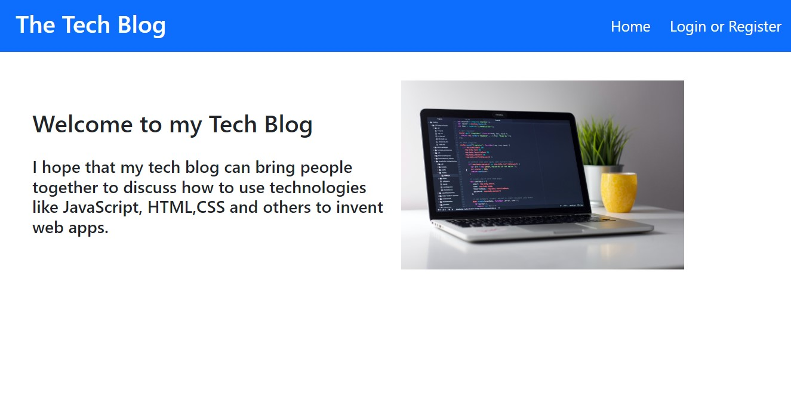
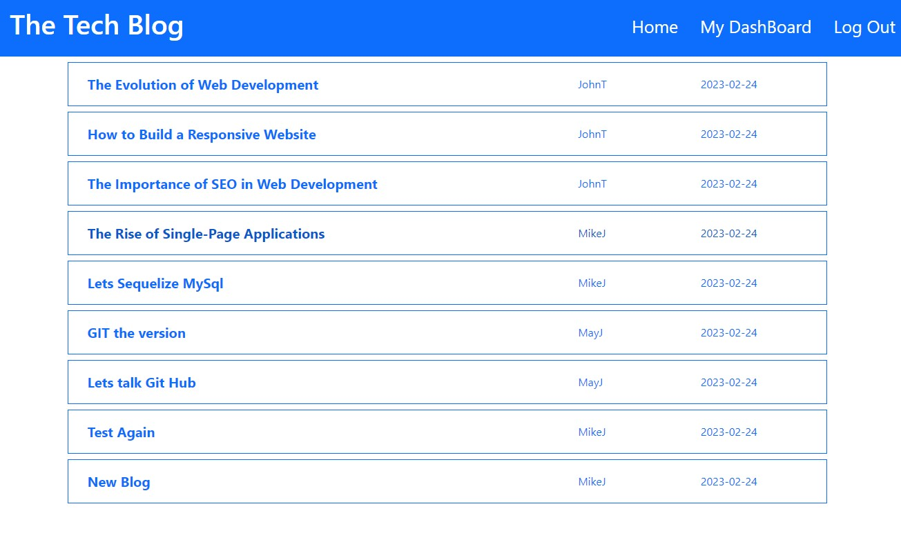
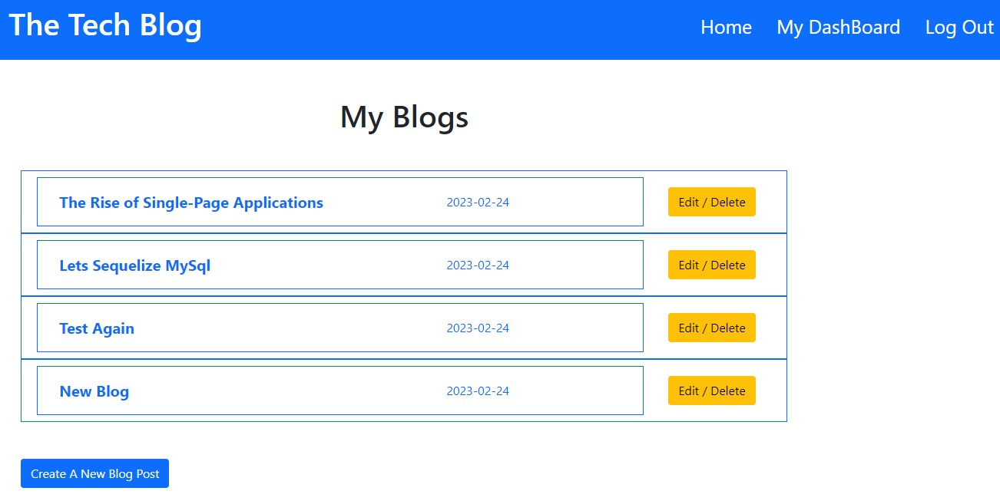
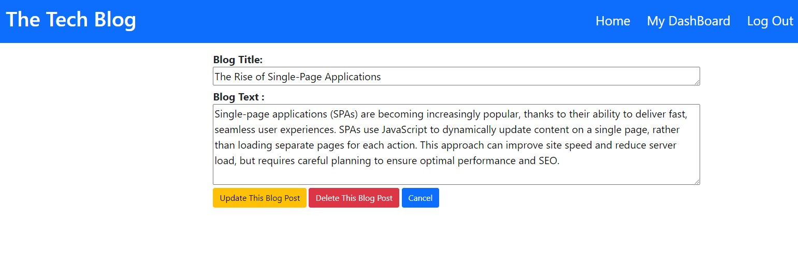
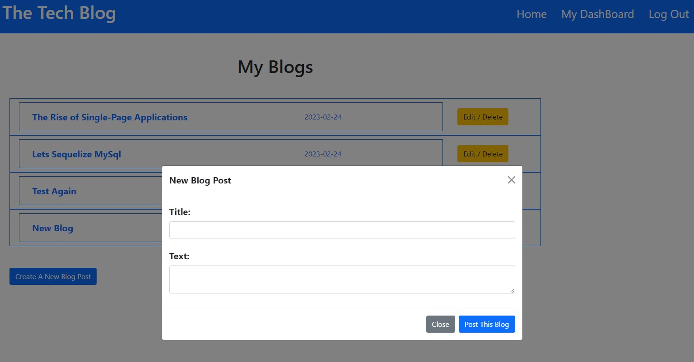
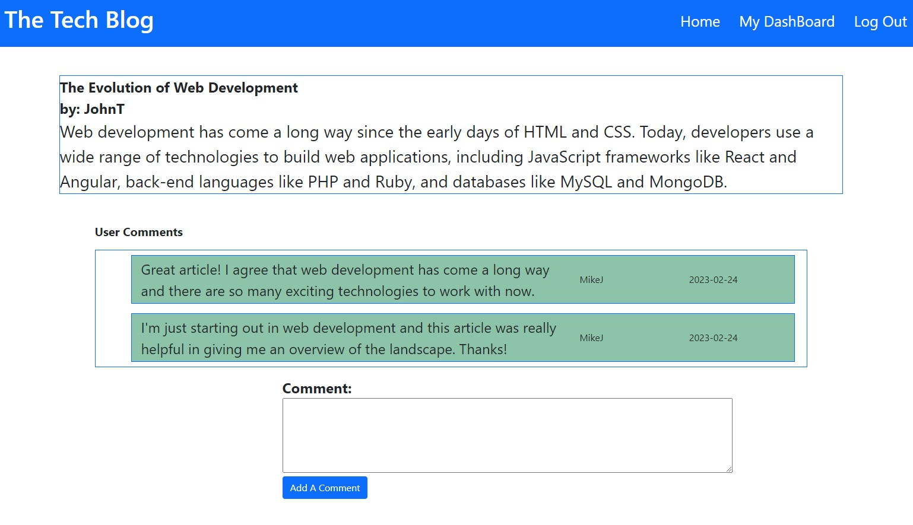

# tech-blog

# **Table of Contents**
1. [Description](#description)
2. [Testing](#testing)
3. [Technology Used and Credits](#technology-used-and-credits)
4. [About the Author](#about-the-author)
5. [License](#license)

Deployed Site: [https://afternoon-badlands-25422.herokuapp.com/](https://afternoon-badlands-25422.herokuapp.com/)

Sample username: 'MikeJ' with a password = 'password'


# **Description**

The goal of this project was to create the back end and front end of a blog portal.  This blog allows users to log into the portal with a user name and password.  Once they are authenticated the users can view blog posts and also add a post of their own.  Additionally, after the post is entered, the user can edit or delete their own posts. Once deleted, all associated comments are also deleted from the comment model / table.  

The back end of this website uses a MySql database.  I utilized the Node.js package - Sequelize to interact with the MySql database including syncing the models and seed data on the start of my server. There are three main modals / tables.  First, the User model houses the username and password and assigns a unique id.  Second, the Entry model/ table houses the blog title and text of each blog entry and also assigns the blog entry a unique id.  Third, the Comment model/ table houses the comment text, the author of the comment (via a foreign key referenced to the User modal) and the blog entry id (via a foreign key referenced to the Entry model).

I used handlebars as my rendering agent and took advantage of partials to render blog titles and details.   

Below is a screen shot of the landing home page before log in. 



Below is a screen shot of the home page after log in. Note the "login / register button does not appear, but the logout button does. 



Below is a screen shot of the logged in user's dashboard that allows navigation to and "edit/delete" page for the selected blog post. 



Below is a screen shot of the edit/ delete page.  This retrieves the title and the text of the blog entry and inserts such content into a editable text field.  The user can then submit the edits, delete the blog or cancel and return to the dashboard. 



Below is a screen shot of the modal used to enter a new blog entry with a title and text content.  



Below is a screen shot of the detailed blog rendering that shows the list of comments.  A user can also add a comment to the blog.   




# **Highlighted Code Example**

The following is code that I created that I would like to highlight.  

In this first block I created the associations between the models.  Note the use of the Entry Has Many Comments and the "onDelete: 'CASCADE' property.  This deletes all comments associated with a Entry if that entry is deleted.  
```
//Users have many entries and entries belong to users

User.hasMany(Entry, {
    foreignKey: 'author_id',
    onDelete: 'CASCADE'
});

Entry.belongsTo(User, {
    foreignKey: 'author_id',
});

// Entry has many comments

Entry.hasMany(Comment, {
    foreignKey:'entry_id',
    onDelete: 'CASCADE'
})

Comment.belongsTo(Entry, {
    foreignKey: 'entry_id',
   
})

//User has many comments
User.hasMany(Comment, {
    foreignKey: 'comment_author'
})

Comment.belongsTo(User,{
    foreignKey: 'comment_author'
})


```

The following is the main blog detail that is displayed when a blog title is selected on the home page or the user dashboard page.  This also uses an {{if}} statement to render any comments.  If there are comments associated with the blog entry then an {{Each}} statement and a handlebar partial ({{ > blog-comments}}) is used to render the comments. 

```
{{!-- This is the blog details page that renders a single blog post with any associated comments.
There is also a button that allows any user to add a comment to the blog post.  Note the use of the 
partial called "blog-comments" --}}
<div class="container mt-5">
  <div class="row border border-primary">
    <div class="row fs-4 fw-bold">{{blogDetail.blog_title}}</div>
    <div class="row fs-4 fw-bold">by: {{blogDetail.user.user_name}}</div>
    <div class="row fs-3" name="blog-detail" id="{{blogDetail.id}}">{{blogDetail.blog_text}}</div>
  </div>
  {{#if blogCommentsArray}}
  <p class="mt-5 ms-5 fs-5 fw-bold">User Comments</p>
  <dir class="row border border-primary mx-5">
    {{#each blogCommentsArray as |commentsX|}}
    {{> blog-comments}}
    {{/each}}
  </dir>
  {{/if}}
  <dir class="d-grid gap-2 col-6 mx-auto">
    <form class="new-comment-form" name="new-comment" id="{{user_id}}">
      <label for="comment" class=" fs-4 fw-bold">
        Comment:
      </label>
      <br />
      <textarea name="comment_text" id="comment_text" cols="100" rows="5">{{comment_text}}</textarea>
      <br />
      <button type="submit" value="Submit" class="btn btn-primary">Add A Comment</button>
    </form>
  </dir>
</div>

<script src="/js/add-comment.js"> </script>

```

# **Testing** 

To test to ensure the code rendered the desired output I iterated a series of tests to ensure that all acceptance criteria were met and documented completion below:

| User Acceptance Criteria | Test Result | 
| ------------- |:-------------| 
|1. WHEN I visit the site for the first time THEN I am presented with the homepage, which includes existing blog posts if any have been posted; navigation links for the homepage and the dashboard; and the option to log in|**Completed**.  Om log in this is rendered.   |
|2. WHEN I click on the homepage option THEN I am taken to the homepage|**Completed**.  This navigation works.   |
|3. WHEN I click on any other links in the navigation THEN I am prompted to either sign up or sign in|**Completed**.  There is one page where a user can log in our sign up.  |
|4. WHEN I choose to sign up THEN I am prompted to create a username and password|**Completed**.  A username and password can be accepted.   |
|5. WHEN I click on the sign-up button THEN my user credentials are saved and I am logged into the site|**Completed**.  A user can sign up by entering a username and password.  |
|6. WHEN I revisit the site at a later time and choose to sign in THEN I am prompted to enter my username and password|**Completed**.  This functionality works.   |
|7. WHEN I am signed in to the site THEN I see navigation links for the homepage, the dashboard, and the option to log out|**Completed**.  This functionality works.    |
|8. WHEN I click on the homepage option in the navigation THEN I am taken to the homepage and presented with existing blog posts that include the post title and the date created|**Completed**.  This functionality works.  |
|9. WHEN I click on an existing blog post THEN I am presented with the post title, contents, post creator’s username, and date created for that post and have the option to leave a comment|**Completed**.  This functionality works.  |
|10. WHEN I enter a comment and click on the submit button while signed in THEN the comment is saved and the post is updated to display the comment, the comment creator’s username, and the date created|**Completed**.  This functionality works.  |
|11. WHEN I click on the dashboard option in the navigation THEN I am taken to the dashboard and presented with any blog posts I have already created and the option to add a new blog post|**Completed**.  This functionality works.  |
|12. WHEN I click on the button to add a new blog post THEN I am prompted to enter both a title and contents for my blog post|**Completed**.  This functionality works through the use of a modal.  |
|13. WHEN I click on the button to create a new blog post THEN the title and contents of my post are saved and I am taken back to an updated dashboard with my new blog post|**Completed**.  This functionality works.  |
|14. WHEN I click on one of my existing posts in the dashboard THEN I am able to delete or update my post and taken back to an updated dashboard|**Completed**.  This functionality works.  |
|15. WHEN I click on the logout option in the navigation THEN I am signed out of the site|**Completed**.  This functionality works.  |
|16. WHEN I am idle on the site for more than a set time THEN I am able to view comments but I am prompted to log in again before I can add, update, or delete comments|**Completed**.  This functionality works.  |


# **Technology Used and Credits**

I used many useful references in completing this project including the following.  In particular, I found the layout of the w3schools reference materials to be extremely intuitive and helpful.  They even have a "try me" feature where elements of code can be reviewed and tested. 


| Technology Used | Resource URL | 
| ------------- |:-------------| 
|  | [https://git-scm.com/](https://git-scm.com/) | 
|  | [https://developer.mozilla.org/en-US/docs/Learn/JavaScript](https://developer.mozilla.org/en-US/docs/Learn/JavaScript) |
|  | [https://nodejs.org/en/](https://nodejs.org/en/) |
|  | [https://dev.mysql.com/doc/refman/8.0/en/](https://dev.mysql.com/doc/refman/8.0/en/) |
|  | [https://sequelize.org/](https://sequelize.org/) |
|  | [https://www.npmjs.com/package/handlebars"](https://www.npmjs.com/package/handlebars)|
|  | [https://getbootstrap.com/](https://getbootstrap.com/)|

# **About the Author**

My name is Brad Coleman. I am fairly new to web development but have considered it a hobby for several years and have hacked my way through learning various aspects including php, html and mysql.  I am currently enrolled in the Cal Berkeley Extension Web Development Boot camp and am excited to learn web development more holistically.  I have spent my earlier career working as a corporate controller / CPA.

- [Linkedin Profile](https://www.linkedin.com/in/brad-coleman-109529/)
- [GitHub Repos](https://github.com/bradcoleman60?tab=repositories)


# **License**

MIT License

Copyright (c) 2022 Brad Coleman

Permission is hereby granted, free of charge, to any person obtaining a copy
of this software and associated documentation files (the "Software"), to deal
in the Software without restriction, including without limitation the rights
to use, copy, modify, merge, publish, distribute, sublicense, and/or sell
copies of the Software, and to permit persons to whom the Software is
furnished to do so, subject to the following conditions:

The above copyright notice and this permission notice shall be included in all
copies or substantial portions of the Software.

THE SOFTWARE IS PROVIDED "AS IS", WITHOUT WARRANTY OF ANY KIND, EXPRESS OR
IMPLIED, INCLUDING BUT NOT LIMITED TO THE WARRANTIES OF MERCHANTABILITY,
FITNESS FOR A PARTICULAR PURPOSE AND NONINFRINGEMENT. IN NO EVENT SHALL THE
AUTHORS OR COPYRIGHT HOLDERS BE LIABLE FOR ANY CLAIM, DAMAGES OR OTHER
LIABILITY, WHETHER IN AN ACTION OF CONTRACT, TORT OR OTHERWISE, ARISING FROM,
OUT OF OR IN CONNECTION WITH THE SOFTWARE OR THE USE OR OTHER DEALINGS IN THE
SOFTWARE.

